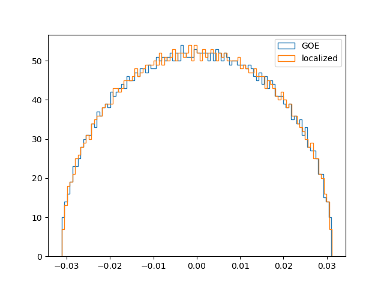

# Quantum-Localization
Minimal code and results from the paper ['Unveiling Order from Chaos by approximate 2-localization of random matrices'](https://www.pnas.org/doi/10.1073/pnas.2308006120)


`goe_spectra` countains spectra in text format. `goe_spectra/N/k` is the kth sample of system size N (dimention $2^N$). All the spetra are normalized to 1.

`localized` contains the coeficients $h_i$ after 2-localization of the GOE spectrums. `localized/N/k` are the $h_i$ corresponding to the kth sample of system size N. The $h_i$ are generated in same order as the $\tau_i$ returned by the `pauli_strings.local2` function.
## Usage
Run `python optimize.py` to localize a spectrum and plot the convergence.
The system size N and sample k, number of gradient descent iterations can be set in `optimize.py` :

```python
if __name__ == "__main__":
    from pauli_strings import*
    # this is an example of localizing a 8 qubit GOE spectrum
    N = 8 # system size (qbit)
    k = 0 # file index (there are 200 spectra for each N stored in goe_spectra, here we open the first one)
    iter = 500 # number of iterations
    taus = local2(N) # list of 2-local pauli strings
    E0 = np.loadtxt('goe_spectra/{}/{}'.format(N,k)) # open the spectrum
    # localize the spectrum. The coeficients of the 2-localized H are stored in h
    loc = Localizer(E0, taus, maxiter=iter)
    h = loc.localize()
    # cost vs iteration plot
    plt.loglog(loc.history)
    plt.xlabel('iteration')
    plt.ylabel('cost')
    plt.show()
```

`plot_spectrum.py` is an example on how to load the coeficients $h_i$ and construct the local hamiltonian.

The 2-local operators $\tau_i$ are generated in `pauli_strings.py`. The $h_i$ results in the folder `localized` are ordered in the same order that the pauli strings are generated in `pauli_strings`.

Running `python plot_spectrum.py` will load a set of coeficients $h_i$, construct $H=\sum_ih_i\tau_i$, diagonalize $H$ and display the following figure where the density of states of the local $H$ is in orange and the intial GOE spectrum is in blue.



## 2-local-only model
The 2-local model used in the paper's also includes 1-local terms (fields). The results in the `localized` correspond to this model with fields, 
$$\sum_{ij, \alpha\beta} J_{ij}^{\alpha\beta} \sigma_i^\alpha \otimes \sigma_j^\beta\ +\sum_{i,\alpha}h_i^\alpha\sigma_i^\alpha,$$
However, we also get very good results without including the field. The SFF matches as well as with the fields and the cost also decreases exponentially with N. 
For convenience of use we also share results for the model with no fields
$$\sum_{ij, \alpha\beta} J_{ij}^{\alpha\beta} \sigma_i^\alpha \otimes \sigma_j^\beta\.$$
These results are saved as coupling matrices in the `couplings` folder. Each file starts with the sample number followed by the type of the coupling. There are 5 files per sample since there are 5 coupling types.
The `couplings_example.py` script shows how to load the couplings and build a Hamiltonian out of them.
